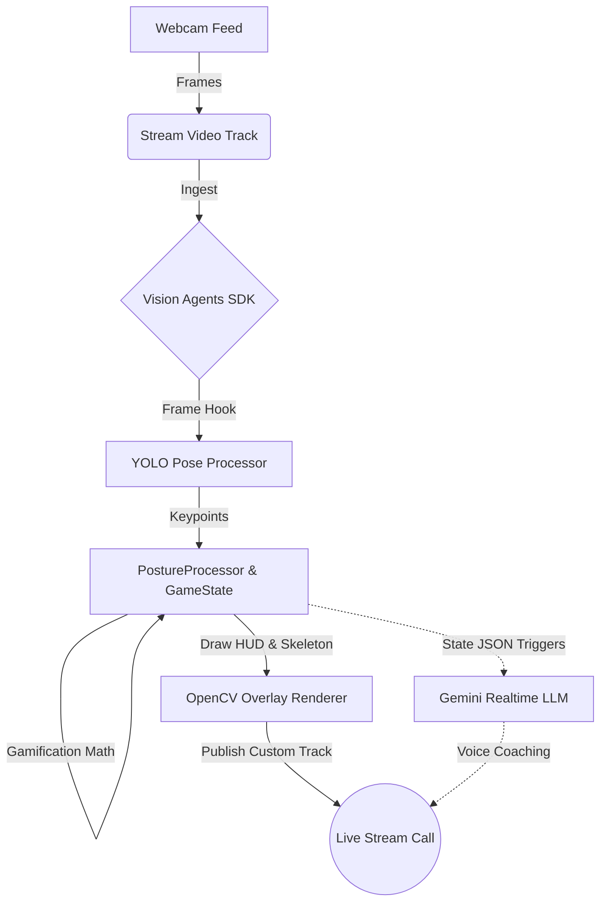

# 🪑⚔️ PosturePaladin: The AI Desk Guardian

  <h3>Defend Your Spine. Level Up Your Health.</h3>
  
An open-source, gamified anti-sedentary AI companion powered by <b>Vision Agents SDK</b> and <b>Live Video Overlays</b>.

---

**PosturePaladin** is not just another posture corrector - it's an interactive, privacy-first gamification layer for your workday. Built entirely over a weekend hackathon (in a couple of hours), this project intercepts your webcam feed, analyzes your physical posture using YOLO skeletal tracking, and renders an interactive RPG-style Heads-Up Display (HUD) directly onto your video calls.

If you sit properly, you gain XP, level up, and regenerate Health. If you slouch, lean, or remain inactive for too long, your Health drains. If it drops too low, the AI (powered by Gemini Realtime) dynamically intervenes over the call to coach you back to health.

### Why This Was Built:
- **The Modern Desk Worker Problem:** We spend 8+ hours a day on video calls, slowly destroying our spines and cardiovascular health.
- **Notification Fatigue:** Traditional posture apps just send annoying push notifications that we instinctively ignore.
- **Engagement through Gamification:** By transforming posture and activity into RPG metrics (Health, XP, Streaks) overlaid directly onto the video feed you are already looking at, the feedback loop becomes deeply engaging.

---

## 🏗️ Tech Stack & Architecture

This project was built to run entirely locally (with optional LLM cloud offloading) to guarantee zero latency on the video feed while keeping AI inference costs near zero.

### Core Stack
- **Framework:** [Vision Agents SDK](https://github.com/GetStream/Vision-Agents/) (Agentic orchestration, RTMP video piping)
- **Computer Vision:** `Ultralytics` (YOLOv11 Pose estimation), `OpenCV` (HUD Rendering)
- **WebRTC/Video:** `Stream` / `getstream` video calling SDK
- **AI/LLM:** `Google Gemini Realtime` (Voice & Coaching)

### Architecture Flow

---

## 🔒 Privacy-First Design

When dealing with continuous live webcams, privacy is the absolute priority. **PosturePaladin** was architected from the ground up to guarantee user safety:

1. **Local-Only Video Processing:** The entire video pipeline (YOLO pose inference, angle math, inactivity tracking, HUD rendering) runs 100% locally on your machine edge. **Video frames NEVER leave your device.**
2. **Structured JSON LLM Triggers:** The system does not send visual data to the cloud LLM. When coaching is needed, the `GameState` engine serializes your *health points and posture severity* into a highly compact JSON string. The LLM only "sees" your math state, not your face.
3. **No Facial Recognition:** The code strictly tracks geometric joints (shoulders, nose, elbows). No biometric identifiers or facial embeddings are ever calculated or stored.
4. **Hardware Killswitches:** The system features a hard-coded `--privacy` CLI toggle. Running `uv run python main.py run --privacy local` entirely severs the LLM connection, allowing you to run the gamification engine completely isolated from the internet.

---

## 🧠 Learning & Growth: The Vision Agents SDK Experience

Building this project solo was an incredible deep-dive into the cutting edge of realtime video streaming mixed with AI agents. Here are my key takeaways working with the **Vision Agents SDK**:

- **Abstraction Magic:** Piping raw local webcam frames into an SFU (Selective Forwarding Unit) WebRTC call natively is notoriously difficult. The Vision Agents SDK completely abstracted the signaling complexities. Writing a custom `VideoProcessorPublisher` allowed me to hook directly into the live frame buffer effortlessly.
- **The Agent `Runner` Pattern:** The SDK's transition to the `AgentLauncher` and `Runner` pattern was crucial. It gracefully handles the notoriously tricky Python `asyncio` event loops required when balancing WebRTC socket connections alongside heavy AI inference blocking tasks.
- **Performance Tuning is Everything:** Webcams produce 30+ frames a second. Cloud LLMs crash if you feed them 30 images a second. The SDK forced me to heavily decouple my processing logic:
    - **Local Pipeline:** OpenCV and YOLO run blazing fast at 30 FPS.
    - **LLM Pipeline:** Triggers only via text events using `handle_text_input`, bypassing the agent's default video ingestion loop to ensure buttery-smooth video output and zero LLM latency backlog.

---

## 🚀 Getting Started

1. Set up a Python environment with `uv`.
2. Populate `.env` with your API keys (Stream, Gemini).
3. Run `uv run python main.py run` (Use `--privacy local` for offline-only mode).
4. A browser window will open automatically. Join the call and start defending your spine!
